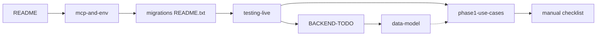

# Documentation hub

All project docs live under **`docs/`**. The **[project README](../README.md)** is the main onboarding entry (features, stack, layout, dev commands).

---

## Reading order

Follow this path the first time you touch the repo:

| Step | Document | Why |
|------|----------|-----|
| 1 | [Project README](../README.md) | What the app does, tech stack, `cd app` workflow, test scripts |
| 2 | [Environment: MCP vs `.env`](backend/mcp-and-env.md) | Why `app/.env.local` exists vs Cursor MCP — avoids confusion |
| 3 | [Migrations runbook](../app/supabase/README.txt) | Exact SQL file order: `0001` → `0002` → `0003` → **`0005`** (optional `0004`) |
| 4 | [Testing against live Supabase](backend/testing-live-supabase.md) | Dashboard auth, first-run checklist, where to see data |
| 5 | [Backend checklist](backend/BACKEND-TODO.md) | Done vs planned (Phase 0–2), what to build next |
| 6 | [Data model](backend/data-model.md) | Tables, views, Phase 2 design (capital policy, bill amendments) |
| 7 | [Phase 1 — automated tests](backend/phase1-use-cases-and-tests.md) | `npm run e2e:*` matrix and RPC expectations |
| 8 | [Phase 1 — manual E2E](backend/phase1-manual-e2e-checklist.md) | What scripts skip; full human QA |

**Shortcut — deploy:** [deployment.md](deployment.md) (GitHub → Supabase → Netlify → Auth URLs).  
**Shortcut — QA day:** steps **3 → 4 → 7 → 8**.  
**Shortcut — schema / roadmap:** steps **5 → 6**.

---

## All documents

### Backend & data

| File | When to open it |
|------|------------------|
| [backend/data-model.md](backend/data-model.md) | Schema, RLS ideas, formulas, Phase 2 (capital, bill amendments) |
| [backend/BACKEND-TODO.md](backend/BACKEND-TODO.md) | Implementation checklist, Phase 2 tasks, production quality bar |
| [backend/mcp-and-env.md](backend/mcp-and-env.md) | `VITE_*` vars, Supabase MCP, security notes |
| [backend/testing-live-supabase.md](backend/testing-live-supabase.md) | Running the app on a real project; auth and dashboard tips |

### Testing & quality

| File | When to open it |
|------|------------------|
| [backend/phase1-use-cases-and-tests.md](backend/phase1-use-cases-and-tests.md) | E2E commands, use-case IDs, what each script asserts |
| [backend/seed-demo-and-reset.md](backend/seed-demo-and-reset.md) | Demo seed, tenant purge, credentials, npm scripts |
| [backend/phase1-manual-e2e-checklist.md](backend/phase1-manual-e2e-checklist.md) | Manual-only coverage, print/UI edge cases, sign-off template |

### Deployment & CI

| File | When to open it |
|------|------------------|
| [deployment.md](deployment.md) | Quick-start deploy: GitHub, Supabase, Netlify, secrets |
| [.github/workflows/ci.yml](../.github/workflows/ci.yml) | Build + lint on every push/PR (no secrets) |
| [.github/workflows/e2e-smoke.yml](../.github/workflows/e2e-smoke.yml) | Supabase smoke test (needs `VITE_*` secrets) |

### Operational (repo tree)

| File | When to open it |
|------|------------------|
| [app/supabase/README.txt](../app/supabase/README.txt) | Copy-paste migrations into Supabase SQL Editor |

---

## Adding a new doc

- Place backend / schema / testing notes under **`docs/backend/`**.
- Link it in the **All documents** table above and add it to **Reading order** if it belongs on the default onboarding path.
- Add a **Navigate** line at the top of the new file pointing back to **[this hub](README.md)** and **[project README](../README.md)**.
