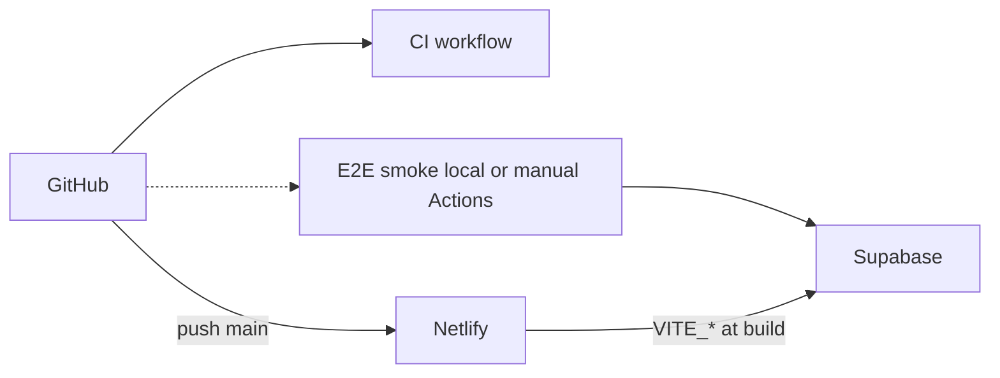

# Deployment guide

**Navigate:** [Docs hub](README.md) · [Project README](../README.md) · [Env & MCP](backend/mcp-and-env.md) · [Migrations](../app/supabase/README.txt) · [Testing live](backend/testing-live-supabase.md)

**Stack:** GitHub (code) → **Netlify** (frontend) → **Supabase** (Auth + Postgres + RPCs). Config: [`netlify.toml`](../netlify.toml) at repo root.

---

## Quick start — deploy in order

Do these **once**, in this order:

| # | Where | Action |
|---|--------|--------|
| 1 | **Local** | `cd app && npm run deploy:check` (lint + production build) |
| 2 | **GitHub** | Create repo, push `main` (see [§ GitHub](#1-github-repository)) |
| 3 | **Supabase** | Run migrations `0001` → `0010`; copy API URL + anon key ([§ Supabase](#2-supabase-before-first-deploy)) |
| 4 | **Netlify** | Import repo; set `VITE_SUPABASE_*` **before** first deploy ([§ Netlify](#3-netlify--exact-click-path)) |
| 5 | **Supabase Auth** | Add Netlify URL to **Site URL** + **Redirect URLs** |
| 6 | **Netlify** | Trigger **Deploy site** (rebuild after env vars) |
| 7 | **Browser** | Open site → register/login → Settings save → one test sale |
| 8 | **GitHub** | Push triggers **CI** only (lint + build). Run **E2E smoke** locally with credentials when needed (`npm run e2e:smoke` in `app/` — see [§ CI workflows](#ci-workflows-github-actions)) |

**Local preflight (before every release):**

```bash
cd app
cp .env.example .env.local   # if you don't have .env.local yet — fill in real values
npm run deploy:check         # lint:tailwind + tsc + vite build
```

---

## Architecture



| Piece | Role | Cost |
|-------|------|------|
| GitHub | Source + Actions | Free |
| Netlify | Host `dist/` from `app/` | Free tier |
| Supabase | Backend | Free tier |

---

## CI workflows (GitHub Actions)

| Workflow | File | Secrets needed | What it runs |
|----------|------|----------------|--------------|
| **CI** | [`.github/workflows/ci.yml`](../.github/workflows/ci.yml) | None | `lint:tailwind` + `npm run build` on every push/PR |
| **E2E smoke** | [`.github/workflows/e2e-smoke.yml`](../.github/workflows/e2e-smoke.yml) | None on push (not triggered). Optional **manual** run: add `VITE_SUPABASE_*` (+ optional `E2E_*`) in Actions | Same lint + Supabase schema/RPC smoke — **default path is local** (`cd app && npm run e2e:smoke` with `.env.local`). |

Team choice: keep smoke **local-only** (no GitHub secrets) or add secrets and use **Actions → Run workflow** occasionally.

---

## Where credentials live

| Secret | Netlify (production build) | GitHub Actions | Local (`app/.env.local`) | Never in git |
|--------|---------------------------|----------------|---------------------------|--------------|
| `VITE_SUPABASE_URL` | Yes | Optional (manual smoke only) | Yes | Real values |
| `VITE_SUPABASE_ANON_KEY` | Yes | Optional (manual smoke only) | Yes | Real values |
| `E2E_EMAIL` / `E2E_PASSWORD` | No | Optional (manual smoke login) | `.e2e-credentials.local` | Yes |
| DB password, `service_role` | No | No | No | Yes — Dashboard/CLI only |

Vite **inlines** `VITE_*` at **build** time. After changing Netlify env vars, **redeploy**.

Template: [`app/.env.example`](../app/.env.example). Details: [Env & MCP](backend/mcp-and-env.md).

---

## Environments

| Environment | Supabase | Frontend | Config |
|-------------|----------|----------|--------|
| Local | Dev project | `npm run dev` | `app/.env.local` |
| Production | Prod (or shared at first) | Netlify `main` | Netlify env vars |
| PR preview | Dev (recommended) | Netlify preview URL | Same as dev or branch vars |

---

## 1. GitHub repository

```bash
cd /path/to/havmor
git init
git add .
git commit -m "Initial commit"
git branch -M main
git remote add origin https://github.com/YOUR_ORG/havmor.git
git push -u origin main
```

Confirm `.gitignore` excludes `app/.env.local`, `app/.e2e-credentials.local`, `app/node_modules/`, `app/dist/`.

---

## 2. Supabase (before first deploy)

1. [supabase.com](https://supabase.com) → project (new or existing).
2. **SQL Editor** — run migrations in order: [`app/supabase/README.txt`](../app/supabase/README.txt)  
   `0001` → `0002` → `0003` → `0005` → `0006` (supplier_payments) → `0007` (`update_sales_bill`) → `0008` (`uom_prices`) → `0009` (`uom_conversion`) → `0010` (`sales_items.unit` + pack stock). Optional `0004` dev-only.
3. **Project Settings → API** — copy:
   - **Project URL** → `VITE_SUPABASE_URL`
   - **anon public** key → `VITE_SUPABASE_ANON_KEY`
4. **Authentication → Providers → Email** — enable; for first deploy you may disable **Confirm email** (see [testing live](backend/testing-live-supabase.md)).
5. After Netlify URL exists: **Authentication → URL configuration**
   - **Site URL:** `https://YOUR-SITE.netlify.app`
   - **Redirect URLs:** that URL + `http://localhost:5173`

---

## 3. Netlify — exact click path

### Import site

1. [app.netlify.com](https://app.netlify.com) → sign in with **GitHub**.
2. **Add new site** → **Import an existing project** → **GitHub** → select **havmor**.
3. Netlify reads root [`netlify.toml`](../netlify.toml):

   | Setting | Value |
   |---------|--------|
   | Base directory | `app` |
   | Build command | `npm ci && npm run build` |
   | Publish directory | `dist` (relative to base → `app/dist`) |
   | Node | `20` (from `NODE_VERSION` in toml) |

4. **Stop** — open **Site configuration → Environment variables** before deploying.

### Environment variables (required for live app)

| Key | Value |
|-----|--------|
| `VITE_SUPABASE_URL` | `https://xxxx.supabase.co` |
| `VITE_SUPABASE_ANON_KEY` | anon key from Supabase API settings |

Scope: **Production** (and **Deploy previews** if previews should use Supabase).

**Save** → **Deploys** → **Trigger deploy** → **Deploy site**.

### Verify production

1. Open `https://YOUR-SITE.netlify.app` — you should get **login/register** (not `MissingSupabaseEnv`).
2. Register or log in → **Settings** → save → row in `tenant_settings`.
3. One sale → `sales_bills` in Supabase Table Editor.

If you see **MissingSupabaseEnv** or a blank setup screen: `VITE_*` env vars missing or deploy happened **before** vars were set → set vars and **redeploy**.

### Custom domain

**Domain management** → add domain → update Supabase **Site URL** + **Redirect URLs** → redeploy if env changed.

---

## 4. E2E smoke (local vs optional GitHub)

**Recommended:** run smoke **on your machine** so credentials never leave your setup.

```bash
cd app
# .env.local + optionally .e2e-credentials.local — see app/.env.example
npm run e2e:smoke
```

Create a smoke test user: `cd app && node scripts/create-e2e-user-and-test.mjs`.

**Optional — same job in GitHub:** add secrets under **Settings → Secrets and variables → Actions**, then **Actions** → **E2E smoke (Supabase)** → **Run workflow**.

| Secret | Required for manual Actions smoke |
|--------|-----------------------------------|
| `VITE_SUPABASE_URL` | Yes |
| `VITE_SUPABASE_ANON_KEY` | Yes |
| `E2E_EMAIL` | No (enables login checks) |
| `E2E_PASSWORD` | No |

---

## 5. Pre-launch checklist

- [ ] `npm run deploy:check` passes locally
- [ ] Migrations `0001` → `0010` on production Supabase (UOM + stock need `0008`–`0010`)
- [ ] Netlify `VITE_*` set; deploy succeeded
- [ ] Supabase Auth URLs include Netlify + localhost
- [ ] Register / login / Settings / one sale on production URL
- [ ] GitHub **CI** workflow green
- [ ] `npm run e2e:smoke` passes locally when you have Supabase + creds (optional: manual Actions smoke with secrets)
- [ ] No `service_role` or DB password in repo or `VITE_*`
- [ ] Supabase backups / PITR before real dealer data ([BACKEND-TODO](backend/BACKEND-TODO.md))

---

## 6. Future integrations

| Feature | Configure in |
|---------|----------------|
| Public keys (e.g. Stripe publishable) | Netlify `VITE_*` |
| Server secrets (SMS, Stripe secret) | Supabase Edge Functions — **not** `VITE_*` |
| Bill images (Phase 2-B) | Supabase Storage + RLS |
| Notifications (Phase 2-A) | Supabase cron / Edge Functions |

---

## Troubleshooting

| Symptom | Fix |
|---------|-----|
| MissingSupabaseEnv on Netlify | Set `VITE_SUPABASE_URL` + `VITE_SUPABASE_ANON_KEY`; **redeploy** |
| Auth redirect error | Exact Netlify URL in Supabase redirect list |
| `signup_tenant` / empty tables | Run migrations ([`README.txt`](../app/supabase/README.txt)) |
| CI build fails | Node 20; `cd app && npm ci && npm run build` locally |
| Smoke fails | Wrong secrets or migrations on that project |
| White/blank hero on Company overview | Pull latest (Tailwind `bg-danger` fix); run `npm run lint:tailwind` |

---

**See also:** [Docs hub](README.md) · [Testing live](backend/testing-live-supabase.md) · [Phase 1 tests](backend/phase1-use-cases-and-tests.md)
